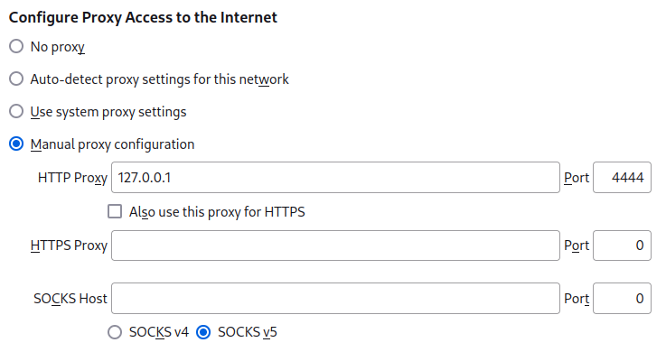

# Browing and Hosting Eepsites

## Configuring your browser

To browse eepsites, your browser must be configured to use `emissary-cli` as an HTTP proxy. The default port for the HTTP proxy is 4444.

### Firefox

Under `Edit > Settings > Network Settings`, specify `emissary-cli` as the HTTP proxy:



Alternatively, you can usethe [I2P in Private Browsing extension](https://github.com/eyedeekay/I2P-in-Private-Browsing-Mode-Firefox).

 ### Chromium

Start Chromium and specify `emissary-cli` as the HTTP proxy:

```bash
chromium --proxy-server="http://127.0.0.1:4444"
```

###

## Hosting an eepsite

To host an eepsite, add a server tunnel to `router.toml`:

```toml
[[server-tunnels]]
name = "my-website"
port = 8080
destination_path = "my-website.b64"
```

Here:
 * `destination_path` is the file path of the destination's private key
 * `port` is the port that a web server on your local machine is listening on

If the destination's private key does not exist, `emissary-cli` automatically generates and stores it on your disk. You can also manually create the private key using any SAMv3 library that supports `DEST GENERATE`. The private key must be a base64-encoded string.

You can find the `.b32.i2p` address of the destination in the router UI under `Destinations`.
