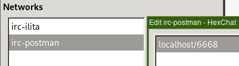

# IRC and Email

The `[[client-tunnels]]` directive specified in `router.toml` provides [I2PTunnel-like](https://geti2p.net/en/docs/api/i2ptunnel) functionality and allows connecting to services hosted inside I2P. Currently only TCP-like connections are supported.

## IRC

A client tunnel must be specified for each network.

* `port` is the port in localhost the IRC client should connect to
* `destination_port` is the port that IRC the server is listening on
* `destination` is the hostname of the IRC server and can be either a `.b32.i2p` or `.i2p` address

If a `.i2p` address is used, the host must exist in your address book.

```toml
[[client-tunnels]]
name = "irc-postman"
address = "127.0.0.1"
port = 6668
destination = "irc.postman.i2p"
destination_port = 6667

[[client-tunnels]]
name = "irc-ilita"
address = "127.0.0.1"
port = 6669
destination = "irc.ilita.i2p"
destination_port = 6667
```

Connecting to Irc2P is simply a matter of adding the configured servers to your IRC client configuration and connecting:

### irssi

```json
servers = (
  {
    address = "127.0.0.1";
    port = "6668";
    use_tls = "no";
    tls_verify = "no";
    starttls = "no";
    chatnet = "irc-postman";
  },
  {
    address = "127.0.0.1";
    port = "6669";
    use_tls = "no";
    tls_verify = "no";
    starttls = "no";
    chatnet = "irc-ilita";
  }
);
```

Start irssi and run `/connect irc-postman` or `/connect irc-ilita`

### HexChat

Specify `localhost/<PORT>` as the server's address where `<PORT>` is the `port` assigned for that network in `router.toml`.

Using the tunnel configuration specified above:
* the address of `irc-postman` is `localhost/6668`
* the address of `irc-ilita` is `localhost/6669`



## Email

To send and read email, SMTP and POP client tunnels must be configured in `router.toml` and the email software must to configured to use the defined `address`:`port` pair as SMTP/POP servers.

```toml
[[client-tunnels]]
name = "pop-postman"
address = "127.0.0.1"
port = 6670
destination = "pop.postman.i2p"
destination_port = 110

[[client-tunnels]]
name = "smtp-postman"
address = "127.0.0.1"
port = 6671
destination = "smtp.postman.i2p"
destination_port = 25
```

### NeoMutt

```toml
set pop_pass = "PASSWORD"
set pop_host = "pop://USER@127.0.0.1:6670"

set smtp_pass = "PASSWORD"
set smtp_url = "smtp://USER@127.0.0.1:6671"
set from = "USER@mail.i2p"

set ssl_force_tls = no
set ssl_starttls = no

set pop_check_interval = 900
set folder = $pop_host
set spool_file =+
```
