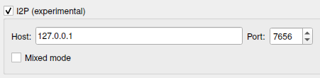

# Torrents

`emissary-cli` supports both I2CP and SAMv3, meaning any torrent client that utilizes either protocol should work. qBittorrent has been tested more extensively and provides higher throughput when used with `emissary-cli`.

## qBittorrent

SAMv3 must be enabled in `router.toml` and I2P must be enabled in qBittorrent. The default SAMv3 TCP listening port for `emissary-cli` is `7656`.

Under `Tools > Preferences > Connection`, enable I2P:

## I2PSnark

Standalone I2PSnark maintained by the [I2P+](https://i2pplus.github.io/) project can also be used for torrenting. The installer is found under `Download I2P+ > I2PSnark Standalone` at the bottom of the page.
